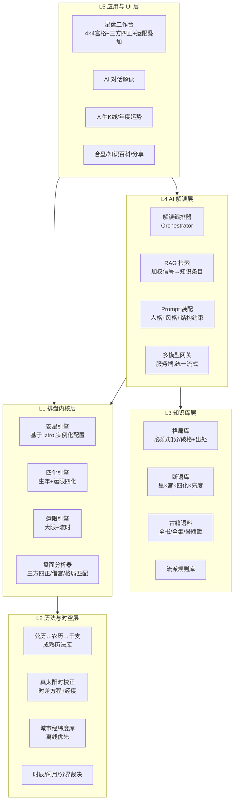

# 紫微斗数 App 设计框架

> 基于对本仓库 6 个开源项目(iztro、dart_iztro、iztro_py、tianji、ziwei「紫微知道」、ziwei-doushu「王多鱼AI」)的深度代码调研,提炼出的一套科学、专业、可落地的紫微斗数应用设计框架。
>
> 调研日期:2026-07

---

## 目录

1. [六项目调研结论速览](#一六项目调研结论速览)
2. [核心设计原则](#二核心设计原则)
3. [总体架构:五层模型](#三总体架构五层模型)
4. [L1 排盘内核层设计](#四l1-排盘内核层设计)
5. [L2 历法与时空层设计](#五l2-历法与时空层设计)
6. [L3 知识库层设计](#六l3-知识库层设计)
7. [L4 AI 解读层设计](#七l4-ai-解读层设计)
8. [L5 应用与 UI 层设计](#八l5-应用与-ui-层设计)
9. [技术选型建议](#九技术选型建议)
10. [测试与质量保障策略](#十测试与质量保障策略)
11. [隐私、安全与合规](#十一隐私安全与合规)
12. [实施路线图](#十二实施路线图)

---

## 一、六项目调研结论速览

| 项目 | 定位 | 排盘算法 | 完整度 | 关键资产 | 关键缺陷 |
|---|---|---|---|---|---|
| **iztro** (TS) | 排盘引擎(事实标准) | 自研,口诀级注释 | ★★★★★ 全星曜+四化+全运限+双流派 | key/译文双向 i18n、插件机制、3000+ 行测试 | 全局可变配置(并发不安全)、无真太阳时、魔法数组多 |
| **dart_iztro** (Flutter) | iztro 移植+扩展 | 纯 Dart 独立实现 | ★★★★★ 对齐 2.5.x,含中州派/天地人盘 | **真太阳时计算、离线城市经纬度库**、八字、6 平台 | 强耦合 GetX、脚手架包名未改 |
| **iztro_py** (Python) | iztro 纯 Py 移植 | 纯 Python 独立实现 | ★★★★ 全运限,缺中州派 | Pydantic 类型建模、`to_iztro_dict` 可对拍 | 分发包不含测试 |
| **tianji** (Py+JS) | 玄学全家桶 | 自研(双端两份) | ★★ 仅 14 主星,无四化/运限 | 隐私优先纯离线架构、LLM 提示词范式 | **五行局算法不符传统、双端结果不一致**、config/LLM 层 import 级错误 |
| **ziwei「紫微知道」** (React SPA) | 纯前端 AI 排盘工具 | iztro + 真太阳时校正 | ★★★★ | **多模型 LLM 适配层、离线加权 RAG 管线、人生K线**、文档驱动工程 | 无三方四正连线、API Key 在前端、无 SEO |
| **ziwei-doushu「王多鱼AI」** (Next.js) | 商业产品开源骨架 | iztro + 自研命理层 | ★★★★ | **1118 行分层格局库、SVG 三方四正连线、运限四化叠加**、古籍原文、51.8 万命盘数据集 | AI 后端/断语库不开源、无状态管理 |

**核心结论:**

1. **排盘算法不要重写**。tianji 从零自研的教训(五行局查法错误、双端漂移)证明:安星诀的实现细节极易出错且难以察觉。iztro 及其移植版是经过大量测试对拍的事实标准,应作为内核基础。
2. **生态已验证"确定性排盘 + 结构化知识 + LLM 解读"三层范式**。四个应用级项目殊途同归地收敛到这个架构,差异只在各层实现深度。
3. **专业度的分水岭在知识库层**,而非排盘层。排盘人人都对(用 iztro),真正拉开差距的是:分层格局库(王多鱼)、来源可信度标注的 RAG(紫微知道)、流派立场的明确声明(两者)。
4. **现有项目没有一个同时做对了**:实例隔离的引擎配置、真太阳时、专业知识库、服务端 AI 网关、命例回归测试。这正是新框架的机会。

---

## 二、核心设计原则

1. **确定性与解释性分离(Determinism/Interpretation Split)**
   排盘是纯函数:相同输入必得相同星盘,可测试、可回归、可跨端对拍。解读是概率性的:LLM 输出、断语匹配都可能变化。两者必须物理分层,禁止解读逻辑污染排盘内核。

2. **流派即配置(School-as-Configuration)**
   紫微斗数不存在唯一"正确"算法——四化派系、年分界(立春/正月初一)、晚子时归属、闰月处理、命主取法在各流派间均有分歧。所有分歧点必须显式建模为配置项,默认值明确标注依据流派,绝不隐式硬编码。iztro 的 `Config` 已覆盖主要分歧点,但其**全局可变状态**是反面教材——配置必须实例隔离。

3. **知识可溯源(Provenance-First Knowledge)**
   每条断语、格局、解读规则必须携带:来源(古籍篇目/近人著作/经验总结)、来源等级、可信度、审核状态。这是"科学专业"与"民间玄学 App"的本质区别,也是紫微知道 `knowledge-db/schema.ts` 已验证的模式。

4. **中文语义、多语呈现(Key-based I18n)**
   沿用 iztro 的 `t()/kot()` 双向映射:内部计算与存储一律用语言无关的 key,任意语言的输入都能反查为 key,输出时再翻译。星曜名不是字符串,是枚举。

5. **隐私默认(Privacy by Default)**
   出生时间+地点是高度敏感的个人数据。排盘计算优先端侧完成(tianji 的离线模式、dart_iztro 的纯 Dart 计算均已验证可行);AI 解读需要出网时,只上传结构化星盘特征而非原始生日,并明确告知。

6. **文档即代码(Documentation as Code)**
   采纳紫微知道的工程约定:架构图、决策记录、进度与代码同仓同步,文件头写明输入/输出契约。命理领域知识密集,没有文档约定的代码三个月后无人能改。

---

## 三、总体架构:五层模型



**数据流(单次排盘→解读):**

```
用户输入(公历生日+出生地+性别)
  → L2 归一化(城市→经纬度→真太阳时→校正后时辰)
  → L1 排盘(纯函数,输出可序列化 Astrolabe)
  → L1 分析(三方四正、借宫、格局匹配 → ChartFeatures)
  → L3 检索(ChartFeatures → 加权命中知识条目)
  → L4 装配 Prompt → LLM 流式输出
  → L5 渲染(盘面 + 解读并列)
```

关键点:**L1 的输出是唯一事实源**。UI 渲染、RAG 检索、Prompt 装配全部消费同一个序列化星盘对象,禁止任何一层自己"再算一遍"(tianji 双端漂移的教训)。

---

## 四、L1 排盘内核层设计

### 4.1 基础选型:以 iztro 算法为内核,修正其架构缺陷

不重写安星算法,但重构其工程外壳:

```typescript
// 反面教材(iztro 现状):模块级全局配置
astro.config({ mutagens: {...} });     // 污染所有后续排盘
const chart = astro.bySolar(...);

// 本框架:引擎实例化,配置随实例走
const engine = new ZiweiEngine({
  school: 'zhongzhou',            // 'default' | 'zhongzhou' | ...
  yearDivide: 'normal',           // 正月初一 | 'exact' 立春
  horoscopeDivide: 'normal',
  dayDivide: 'forward',           // 晚子时归次日(子初换日)
  ageDivide: 'birthday',
  mutagens: undefined,            // 可覆盖四化表(飞星派等)
  brightness: undefined,          // 可覆盖亮度表
});
const chart = engine.bySolar('2000-08-16', 6, 'male');
```

- 每个配置项的默认值在文档中注明流派依据(如「对齐文墨天机/中州派」,紫微知道 `astro.ts` 的做法)。
- 引擎无任何模块级可变状态,天然支持并发、批量排盘、A/B 流派对比(同一生日双引擎并排展示)。

### 4.2 星盘数据模型(可序列化,跨层唯一契约)

```typescript
interface Astrolabe {
  meta: {
    engineVersion: string;        // 排盘引擎版本,存档必带(算法修正后可识别旧盘)
    school: SchoolConfig;         // 完整配置快照,保证可复现
    input: NormalizedInput;       // 归一化后的输入(含真太阳时校正记录)
  };
  dates: { solar; lunar; ganzhi; timeIndex; isAdjustedByTrueSolarTime };
  fiveElementsClass: FiveElementsClassKey;
  soul: StarKey; body: StarKey;   // 命主、身主
  soulPalaceBranch: BranchKey; bodyPalaceBranch: BranchKey;
  palaces: Palace[12];            // 寅宫起,索引 0-11
}

interface Palace {
  index: number;
  name: PalaceKey;                // key,非中文字符串
  stem: StemKey; branch: BranchKey;
  isBodyPalace: boolean; isOriginalPalace: boolean;
  majorStars: Star[]; minorStars: Star[]; adjectiveStars: Star[];
  changsheng12: StarKey; boshi12: StarKey;
  jiangqian12: StarKey; suiqian12: StarKey;
  decadal: { range: [number, number]; stem: StemKey; branch: BranchKey };
  ages: number[];                 // 小限
  // ↓ 王多鱼 algorithm.ts 已验证的增强字段:借宫结构化,勿让下游自推
  borrowed?: { fromBranch: BranchKey; stars: Star[] };
}

interface Star {
  key: StarKey;                   // 枚举 key
  type: 'major'|'soft'|'tough'|'adjective'|'flower'|'helper'|'lucun'|'tianma';
  scope: 'origin'|'decadal'|'yearly'|'monthly'|'daily'|'hourly';
  brightness?: BrightnessKey;     // 庙旺得利平不陷
  mutagen?: MutagenKey;           // 禄权科忌(生年)
}
```

### 4.3 盘面分析器(Analyzer):把"命理师的眼睛"代码化

排盘之上、解读之下,提供确定性的结构分析,输出 `ChartFeatures` 供 RAG 与 UI 共用:

- **三方四正**:本宫 / 对宫(+6) / 三合(+4, +8),iztro `surroundedPalaces` 已有,补充运限盘叠加版本。
- **借宫**:空宫借对宫主星,输出结构化字段(王多鱼做法),而不是让 LLM 从文字描述里猜。
- **四化飞化**:生年四化落宫、运限四化叠加;若配置启用飞星派,增加宫干自化(注意:王多鱼因倪派立场刻意关闭此项——这正是"流派即配置"的例证)。
- **格局匹配**:消费 L3 格局库的"必须/加分/破格"三层条件,输出 `matchedPatterns: {patternId, satisfied, bonusHits, brokenBy}[]`。
- **信号生成**:为 RAG 输出加权信号(紫微知道 `deriveGuidanceSignals` 模式:「星+宫」55-75 分、「星+四化+宫」100 分、「杀破狼/机月同梁」等格局信号)。

### 4.4 多端一致性策略

若需要多端原生实现(TS + Dart + Python),必须建立**黄金命例对拍机制**(详见第十节)。iztro_py 的 `to_iztro_dict()` 已示范:所有实现输出统一 JSON 结构,与参考实现逐字段对比。推荐:TS 为参考实现,其他端的 CI 必跑对拍。

---

## 五、L2 历法与时空层设计

历法错误是排盘错误的最大来源,原则是**复用成熟历法库 + 薄封装斗数专用裁决**:

| 能力 | 方案 | 依据 |
|---|---|---|
| 公历↔农历↔干支 | TS: `lunar-lite`/`lunar-typescript`;Dart: `lunar`;Py: `lunar_python` | 三个 iztro 系项目一致选择,勿自研 |
| 闰月裁决 | 闰月前 15 天算本月、之后算下月(可配置) | iztro `fixLunarMonthIndex` |
| 晚子时 | 23:00-24:00 归当日或次日,配置项 `dayDivide` | iztro;紫微知道选 `forward`(子初换日)对齐文墨天机 |
| 年分界 | 正月初一 vs 立春,配置项 | iztro `yearDivide` |
| **真太阳时** | 平太阳时 + 时差方程(Spencer 公式)+ 经度修正((当地经度-120°)×4分钟) | dart_iztro `solar_time_calculator.dart`、紫微知道 `true-solar-time.ts` 双重验证 |
| 城市经纬度 | **离线内置**中国城市库(参考 `88250/city-geo`、dart_iztro `city.json`),海外城市走地理 API 兜底 | dart_iztro `geo_lookup_service.dart` 的"本地优先+网络兜底" |

UI 要求:真太阳时校正后若**时辰发生变化**,必须显著提示用户(紫微知道 CenterInfo 的做法),并允许用户手动选择是否采用——这是专业排盘软件与玩具的分界线之一。

---

## 六、L3 知识库层设计

这是决定 App 专业度的层。综合王多鱼(内容深度)与紫微知道(检索工程)的优点:

### 6.1 知识条目 Schema(独立数据文件,禁止硬编码)

```typescript
interface KnowledgeEntry {
  id: string;
  domain: 'star'|'palace'|'mutagen'|'pattern'|'combination'|'horoscope';
  entities: EntityRef[];          // 关联的星/宫/四化 key 组合
  topics: Topic[];                // career | wealth | marriage | health | ...
  content: {
    summary: string;              // 一句话断语
    detail: string;               // 展开解释
    guidance?: { focus: string[]; nuance: string[]; avoid: string[] };
                                  // 给 LLM 的导向:强调什么/如何拿捏/避免什么
  };
  source: {
    level: 'classic'|'annotated'|'modern'|'empirical';
                                  // 古籍原文 / 古籍注解 / 近人著述 / 经验总结
    ref: string;                  // 如《紫微斗数全书·骨髓赋》;倪海夏天纪讲义 卷X
    school?: SchoolKey;           // 三合 | 飞星 | 中州 | 钦天 | ...
  };
  confidence: number;             // 0-1
  reviewStatus: 'draft'|'reviewed'|'verified';
}
```

### 6.2 格局库:三层条件模型(采纳王多鱼 `patterns.ts` 结构)

每个格局(紫府同宫、君臣庆会、火贪、铃贪、杀破狼、机月同梁、日月并明……)定义:

- **required(必须)**:不满足即不成格,机器可判(星落宫、亮度、三方会照条件)。
- **bonus(加分)**:成格后的增强条件(会吉、化禄权科)。
- **broken(破格)**:煞忌冲破条件。
- **source**:古籍出处原句。

格局判定完全在 L1 Analyzer 确定性执行,LLM 只消费判定结果,绝不让 LLM 自己"看盘认格局"。

### 6.3 内容建设策略

1. **骨架先行**:14 主星 × 12 宫 = 168 条基础断语 + 四化 40 条(10 干 × 4)+ 主要格局 60-80 个,约 300 条即可支撑 MVP 的 RAG。
2. **古籍语料库**:全书/全集/骨髓赋/太微赋原文分篇入库(王多鱼 `lib/classics/` 已示范),供 RAG 引用与 App 内古籍阅读器复用。
3. **审核流水线**:`draft → reviewed(命理编辑) → verified(多来源互证)`,LLM 生成初稿可以,但入库必须过人工审核——这是 confidence 与 reviewStatus 字段存在的意义。
4. **流派标注**:同一星宫组合在不同流派断语不同时,并存多条并以 `school` 区分,检索时按用户流派配置过滤。

---

## 七、L4 AI 解读层设计

### 7.1 架构:服务端 AI 网关(修正紫微知道的前端 Key 缺陷)

```
客户端 ── 结构化星盘特征(非原始生日) ──▶ /api/interpret (SSE 流式)
                                          │
                                          ├─ RAG 检索(L3)
                                          ├─ Prompt 装配
                                          └─ 多模型网关(Claude / DeepSeek / Kimi / Gemini / OpenAI 兼容)
```

- **多模型适配层**直接借鉴紫微知道 `llm.ts`:统一 `streamChat` 接口,封装各家 SSE 差异、思考模式(extended thinking / reasoning_effort)、原生联网搜索;无原生搜索的模型走 Tavily 等检索 API。
- 但 Key 与 Prompt 放**服务端**(王多鱼的 `/api/interpret` 模式):公网产品绝不可把 Key 打进前端。自部署开源版可保留"自带 Key 纯前端"模式作为降级选项——两种模式共用同一适配层代码。

### 7.2 RAG 管线(采纳紫微知道 `retrieval/context.ts` 的加权信号模式)

```
ChartFeatures(L1 输出)
  → 信号生成:星+宫(55-75)、星+四化+宫(100)、成格格局(90)、破格(85)…
  → 按信号权重 × 条目 confidence × 流派匹配 检索 Top-K 知识条目
  → buildGuidanceContext:装配为"专业知识导向"区块
  → 注入 system prompt,并明确约束「自然融入,不要逐条复述」
```

### 7.3 Prompt 工程规范(综合紫微知道 + tianji 的已验证范式)

System prompt 固定五要素:

1. **人格与师承**:命理师人设 + 明确流派立场(如「三合为体、四化为用,参照中州派」)。
2. **知识注入区**:RAG 结果 + 本盘结构化特征(命宫三方四正、成格/破格、大限流年四化)。
3. **语言风格约束**:禁"能量/磁场/宇宙频率"等身心灵话术;吉凶并陈,不恐吓不谄媚;白话为主、术语随释。
4. **固定输出结构**:命格总断 → 分域(事业/财/婚姻/健康/六亲)→ 隐忧与建议 → 一句收束。结构化输出便于前端分节渲染与缓存。
5. **强制免责声明**(tianji 范式):解读仅供参考,不构成医疗/投资/重大决策建议。

### 7.4 成本与缓存

- 解读结果按 `(chartHash, school, topic, year, modelId, promptVersion)` 缓存(紫微知道按年缓存运势的做法),命中即免调用。
- 分级模型路由:结构化短任务(K线年度评分理由、关键词提取)走轻量模型,深度解读走旗舰模型。

---

## 八、L5 应用与 UI 层设计

### 8.1 星盘工作台(核心界面,集两家之长)

- **布局**:传统 4×4 十二宫网格,外圈 12 宫、中央 2×2 信息区(公历/农历/干支、五行局、命主身主、真太阳时校正提示)。全部四个应用项目一致采用,是用户心智标准。
- **宫位卡**:主星(亮度角标+四化色标:禄绿/权紫/科蓝/忌红)、辅星、杂曜、四长生/博士十二神;命宫与身宫特殊描边;空宫显示借宫星(半透明样式区分)。
- **三方四正联动**(王多鱼 `ChartBoard.tsx` 的 SVG 方案):点击宫位 → SVG 叠加层绘制对宫直线 + 三合三角形 + 宫心标记,动画淡入。这是专业盘面的标志性交互,必做。
- **运限时间轴**(王多鱼 `TimeNav.tsx` 模式):本命/大限/流年(/流月/流日)分段导航,流年支持年份步进;切换时在盘面**叠加该运限天干四化角标**(「限」「年」标记),导航条下方列出当期四化明细。
- **响应式**:桌面「盘面+解读侧栏」双栏(1fr/380px);移动端盘面优先、解读抽屉化、底部 Tab 导航(紫微知道模式)。宫格文字密度按断点分级(小屏只显主星+四化)。

### 8.2 功能模块地图

| 模块 | 优先级 | 参考实现 |
|---|---|---|
| 排盘工作台(上述) | P0 | 王多鱼盘面 + 紫微知道中宫信息 |
| AI 对话解读(流式,预设问题引导) | P0 | 王多鱼 `ChatPanel` |
| 档案管理(多人命盘,本地优先存储) | P0 | 紫微知道 Dexie 方案 |
| 年度运势(按年 AI 解读+缓存) | P1 | 紫微知道 `YearlyFortune` |
| **人生K线**(1-100 岁运势 OHLC 图+大运分界线+评分雷达) | P1 | 紫微知道 `LifeKLine`(差异化记忆点) |
| 合盘/合婚 | P1 | 王多鱼 `heming` + 紫微知道 `MatchAnalysis` |
| 分享卡片(canvas 生成命盘图) | P1 | 两家均有,html2canvas |
| 知识百科(星×宫静态页,SEO) | P2 | 王多鱼 `knowledge/[star]/[topic]` |
| 古籍阅读器+全文检索 | P2 | 王多鱼 `library` |
| 名人命盘 | P2 | 王多鱼 `famous.ts` |
| 流派对比模式(同盘双引擎并排) | P2 | 本框架新增(实例化引擎的红利) |

### 8.3 视觉系统

- 深色星空基调(深靛蓝 #1a1b3a 系)+ 星光紫(#6366f1)+ 暖琥珀点缀(#f59e0b),毛玻璃卡片、微光效果(紫微知道设计方案,参考 Co-Star/Headspace 的"神秘但克制")。
- CSS Variables 设计令牌 + 亮/暗双主题(王多鱼 `--t-gold/--t-border` 模式)。
- 四化色彩语义全局唯一并配图例;亮度用字号/透明度层级而非颜色(避免与四化色冲突)。
- 动效克制:宫格入场 stagger(40ms/格)、三方四正连线淡入、解读打字机效果(35ms/字)。

---

## 九、技术选型建议

### 9.1 三种可行形态(按目标选择)

| 形态 | 技术栈 | 适用 | 依据 |
|---|---|---|---|
| **A. 内容平台型**(推荐默认) | Next.js 15 App Router + React 19 + Tailwind + Zustand + Postgres/Redis | 要 SEO(百科/古籍/名人盘引流)、要账号与商业化 | 王多鱼已验证,SSR+静态百科页是命理站获客主渠道 |
| B. 纯工具型 | Vite + React SPA + Zustand + Dexie,零后端 | 开源自部署、隐私极致、零运营成本 | 紫微知道已验证 |
| C. 移动原生型 | Flutter + dart_iztro(解耦 GetX)+ 服务端 AI 网关 | App Store 分发、离线排盘 | dart_iztro 已验证纯 Dart 六平台 |

**推荐组合**:A 为主站 + 排盘内核抽成独立 npm 包(实例化引擎),未来 C 复用 dart_iztro 对拍同一套黄金命例。B 作为开源社区版与主站共享内核与 UI 组件。

### 9.2 各层选型清单

- **排盘内核**:TypeScript,fork iztro 重构(实例化配置、真太阳时、Analyzer、借宫字段),独立包 + 独立版本号。
- **历法**:lunar-lite / lunar-typescript(TS)。
- **状态**:Zustand(chart / settings / cache 三 store 分治,settings 持久化)。
- **本地存储**:Dexie(IndexedDB)存命盘档案;敏感数据不上云为默认。
- **AI 网关**:服务端 Route Handler(SSE),多模型适配层复用紫微知道 `llm.ts` 模式;默认旗舰模型走 Claude(`claude-fable-5` / `claude-opus-4-8`),轻任务走轻量模型,并保留 OpenAI 兼容协议接入国产模型。
- **图表**:ECharts(人生K线 OHLC)+ 轻量 SVG 自绘(雷达、盘面连线)。
- **动画**:Framer Motion。
- **工程**:pnpm monorepo(`packages/core` 排盘内核、`packages/knowledge` 知识库、`apps/web`、`apps/mobile`);husky + lint-staged + 中文标点 lint(王多鱼 `zh-punct-lint` 值得直接搬用)。

---

## 十、测试与质量保障策略

命理软件的正确性无法靠肉眼验收,必须体系化(tianji 的"只测结构不测数值"是反面教材):

1. **黄金命例回归库(最重要)**
   收集 50-100 个已被多个权威排盘软件(文墨天机等)交叉验证的命例,固化为 JSON fixture:输入(生日/时辰/性别/流派配置)→ 期望输出(逐宫星曜、四化、五行局、大限)。任何算法改动必须全量通过。边界命例必含:闰月生人、晚子时、立春前后、子时跨日、极端年份。
2. **跨实现对拍**:多端实现(TS/Dart/Py)在 CI 中对同一批黄金命例输出统一 JSON(`to_iztro_dict` 模式)逐字段 diff。
3. **属性测试**:对任意合法输入:12 宫必齐、14 主星必全、四化必为 4 星、命宫身宫关系满足口诀、大限区间连续无重叠。
4. **流派配置矩阵测试**:每个配置项至少一组"同盘不同配置输出差异"的断言,防止配置失效性回归。
5. **知识库 lint**:CI 校验每条 KnowledgeEntry 的 schema、来源非空、entities 引用的 key 存在、`verified` 条目不可被静默修改。
6. **AI 层评测**:固定命例 + 固定 prompt 版本做快照评测(是否遵守输出结构、是否复述知识库、是否出现禁用话术),prompt 变更走版本号。

---

## 十一、隐私、安全与合规

1. **数据分级**:出生时间+地点=敏感个人信息。端侧排盘、本地存储为默认;云端同步显式 opt-in 且加密。
2. **AI 上行最小化**:调用 LLM 只发送结构化星盘特征与虚岁,不发送精确出生时间戳与姓名(星盘特征不可逆推精确生日)。
3. **内容安全**:免责声明常驻(解读不构成医疗/投资/法律建议);未成年人保护;避免宿命论断言式话术(prompt 层已约束,UI 层同样标注)。
4. **开源边界**(若开源):排盘内核、UI、知识 schema 开源;断语库正文与生产 prompt 可闭源(王多鱼模式)——在 README 明确"未包含部分",避免社区困惑。
5. **合规**:中国大陆上线需 ICP 备案(王多鱼已示范);生成式 AI 服务按当地法规完成备案/标识。

---

## 十二、实施路线图

### Phase 0:内核奠基(3-4 周)
- Fork iztro → 实例化引擎重构(去全局状态),接入真太阳时 + 离线城市库(移植 dart_iztro/紫微知道实现)。
- 建黄金命例回归库(≥50 例)+ CI。
- 定稿 `Astrolabe`/`ChartFeatures`/`KnowledgeEntry` 三大 schema。
- **验收:与文墨天机对拍 50 命例全绿。**

### Phase 1:MVP(4-6 周)
- 星盘工作台:4×4 盘面 + 三方四正 SVG 连线 + 本命/大限/流年切换与四化叠加。
- 档案管理(Dexie 本地存储)。
- 知识库骨架 300 条(168 星宫断语 + 40 四化 + 主要格局)。
- 服务端 AI 网关 + RAG 管线 + 对话解读(单模型即可)。
- **验收:输入生日 → 专业盘面 → 有据可查的 AI 解读全链路可用。**

### Phase 2:差异化(4-6 周)
- 人生K线 + 年度运势(含缓存)、合盘、分享卡片。
- 多模型网关、解读缓存、分级路由。
- 格局库扩至 60-80 个(三层条件模型)。
- 移动端响应式打磨 + 亮暗主题。

### Phase 3:平台化(持续)
- 知识百科静态页(SEO)、古籍阅读器、名人命盘。
- 流派对比模式;i18n(内核 key 化已就绪,补 locale 即可)。
- 账号体系与云同步(opt-in);Flutter 端启动(复用黄金命例对拍)。

---

## 附:本仓库六项目可直接复用的资产索引

| 资产 | 来源 | 位置 |
|---|---|---|
| 排盘算法全集(含口诀注释) | iztro | `src/star/location.ts`、`src/astro/palace.ts` |
| 运限推算 | iztro | `src/astro/FunctionalAstrolabe.ts` |
| 流派配置模型 | iztro | `src/data/types/astro.ts` (Config) |
| key/译文双向 i18n | iztro | `src/i18n/` |
| 真太阳时计算 | dart_iztro | `lib/solar_time_calculator.dart` |
| 离线城市经纬度库 | dart_iztro | `assets/data/city.json`、`city_lat.json` |
| Pydantic 星盘建模 / 对拍输出 | iztro_py | `src/iztro_py/data/types.py`、`to_iztro_dict` |
| LLM 提示词范式(免责声明) | tianji | `src/tianji/llm/prompts.py` |
| 多模型流式适配层 | 紫微知道 | `app/src/lib/llm.ts` |
| 加权 RAG 检索管线 | 紫微知道 | `app/src/knowledge-db/retrieval/context.ts` |
| 知识条目 schema | 紫微知道 | `app/src/knowledge-db/schema.ts` |
| 人生K线可视化 | 紫微知道 | `app/src/components/kline/LifeKLine.tsx` |
| 真太阳时(TS 版)+ 城市数据 | 紫微知道 | `app/src/lib/true-solar-time.ts` |
| 文档驱动工程约定 | 紫微知道 | `AGENTS.md`、`docs/dev/project-map.md` |
| 三方四正 SVG 连线 | 王多鱼 | `components/ChartBoard.tsx` |
| 运限导航+四化叠加 | 王多鱼 | `components/TimeNav.tsx` |
| 三层格局库(1118 行) | 王多鱼 | `lib/ziwei/patterns.ts` |
| 借宫结构化 | 王多鱼 | `lib/ziwei/algorithm.ts` |
| 古籍语料 | 王多鱼 | `lib/classics/` |
| 合盘方法论 | 王多鱼 | `lib/ziwei/heming-knowledge.ts` |
| 51.8 万命盘数据集 | 王多鱼 | GitHub Releases(可商用,供微调/RAG) |
| 中文标点 lint | 王多鱼 | `scripts/zh-punct-lint.mjs` |
